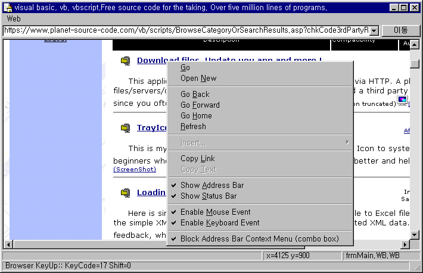



## WebbrowserEx \- Mouse/Keyboard Event Enabled WebBrowser \(Control\)

### Description

Give the standard mouse and keyboard events to your webbrowser application. Try Ctrl+N and you will find that a new instance of the form opens instead a default internet explorer instance and mouse and keyboard events still work. Since thread-wide hookings are used, you can always override default mouse/keyboard actions oriented to your app any time and any where.(Fully tested with SDI, but not tested with MDI). Rather than a complete browser application, this project will help you get (hidden) child window handle, handle thread-wide mouse and keyboard hookings, and create and maintain multiple instances of a hooked user control safely. These techniques will be some help when normal VB ways fail and you need to take a different measure. You can compile three groups of codes contained in this project, mouse hooking class, keyboard hooking class, and webbrowser control separatly, and make three separate dll or ocx to get reusable components and use them when you need one in your application. I originally developed this sample project using these dll and ocx componenets but just aggregate them to post here and for your easier access to the codes.

Enjoy them.
 
### More Info
 

             |
---                |---
**Submitted On**   |2002-07-08 22:59:00
**By**             |[S\.Y\. Kim](https://github.com/Planet-Source-Code/PSCIndex/blob/master/ByAuthor/s-y-kim.md)
**Level**          |Advanced
**User Rating**    |5.0 (40 globes from 8 users)
**Compatibility**  |VB 6\.0
**Category**       |[Internet/ HTML](https://github.com/Planet-Source-Code/PSCIndex/blob/master/ByCategory/internet-html__1-34.md)
**World**          |[Visual Basic](https://github.com/Planet-Source-Code/PSCIndex/blob/master/ByWorld/visual-basic.md)
**Archive File**   |[Webbrowser103452782002\.zip](https://github.com/Planet-Source-Code/s-y-kim-webbrowserex-mouse-keyboard-event-enabled-webbrowser-control__1-36708/archive/master.zip)

